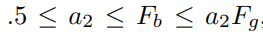
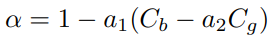

# Bayesian matting

## Compositing functions

### Porter and Duff's **alpha channel**

A famous compositing operation, the *over* operation:
```
C = αF + (1-α)B
``` 
where C, F and B are the pixel's composite, foreground, and background color respectively, and α is the opacity used to linearly blend foreground and background.

## Constant Background Matting techniques

### Blue screen matting, Smith and Blinn's assumption

Video is filmed with a constant-colored background. Foreground and alpha treatment is extracted individually for each frame. In this case, we have 3 observations (R,G,B) and wish to find F (including its alpha) (4 variables).  

#### Smith and Blinn's assumption


where 




http://grail.cs.washington.edu/projects/digital-matting/papers/cvpr2001.pdf

### Mishima matting

Using triangular meshes.

## Natural image matting

In most case, images won't be presented with a constant color background. In this case, it becomes a natural image matting problem.

### Ruzon-Tomasi alpha estimation

Difficulties:

- Objects existing below the resolution of camera, like hair
- Small objects (hair) occupying less than 1 pixel would result in pixels receiving light from more than one object.