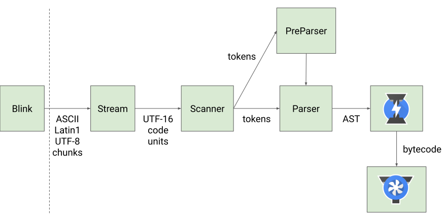
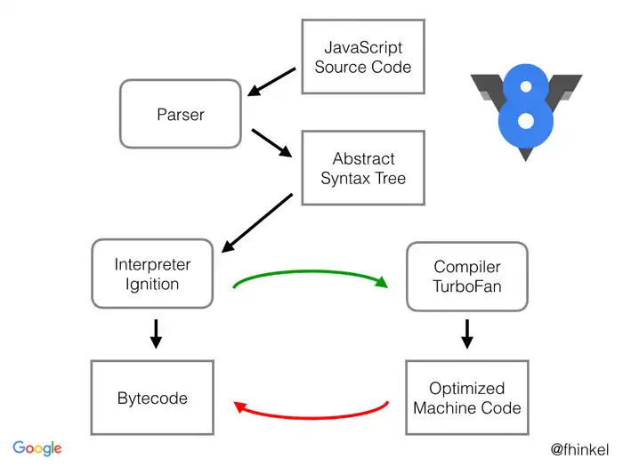

# V8 engine

Basically the program that converts javascript source codes into machine codes.

V8 is part of Chrome, there are similar engines:
- SpiderMonkey in Firebox
- Chakra in Microsoft edge

A tool called [jsvu](https://github.com/GoogleChromeLabs/jsvu) lets you easily test several available engines (and specific versions) without compiling them.

## Flow of V8 engine

### Parser

Parser in V8 has two parts: Parser and Pre-parser:

There is such split because we want to avoid too much eager parsing that would:
- delay the availability of code that is needed for startup
- take up memory, until it is flushed and garbage collected
- code compiled by the time the top-level script finishes executing ends up being cached on disk, taking up disk space (?)

Parser parse the code that have to run now (Eager parsing) into AST, building scopes, etc.

Pre-parser does the bare minimum (checks syntax) in order to skip a function that is not immediately called.